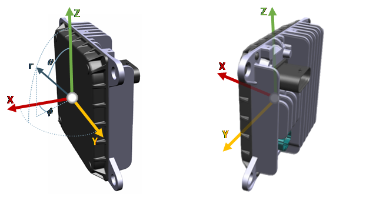

# FRGen21 ROS 2 Driver

## About the project

This is the ROS 2 driver for the ZF FRGen21 Imaging Radar Sensor. This driver supports the firmware versions R01.xx - R03.xx with ZX data format.

*DISCLAIMER*: This software is provided for testing purposes only. The company ZF Friedrichshafen AG accepts no responsibility for any consequences arising from its usage.

## Getting started

### Prerequisites

* [ROS 2 Humble](https://docs.ros.org/en/humble/index.html)
* Boost (C++ libraries)
    ```sh
    sudo apt install libboost-all-dev
    ```
## Installation
1. Create workspace folder
    ```sh
    mkdir -p ~/ros2_ws/src
    cd ~/ros2_ws/src
    ```
2. Clone repo (or download _frgen21_ros2_driver_ folder)
    ```sh
    git clone --recursive https://git.emea.zf-world.com/frgen21/frgen21_ros2_driver.git
    cd ..
    ```
3. Build project
    ```sh
    colcon build --symlink-install --cmake-args -DCMAKE_EXPORT_COMPILE_COMMANDS=ON
    ```
4. Start project with launch file (starts frgen21_node with default sensor configuration and rviz for visualization)
    ```sh
    source install/setup.bash
    ros2 launch frgen21_ros2 frgen21_visu.launch.py
    ```

## Usage

### Output messages
* [sensor_msgs/msg/PointCloud2](https://docs.ros2.org/latest/api/sensor_msgs/msg/PointCloud2.html)
* [frgen21_msgs/msg/RadarScanExtended](https://git.emea.zf-world.com/frgen21/frgen21_msgs/-/blob/main/msg/RadarScanExtended.msg) (radar point targets in spherical coordinates)
* [frgen21_msgs/msg/RadarInfo](https://git.emea.zf-world.com/frgen21/frgen21_msgs/-/blob/main/msg/RadarInfo.msg) (additional sensor info like firmware version, range mode, etc.)
* [frgen21_msgs/msg/RadarFrame](https://git.emea.zf-world.com/frgen21/frgen21_msgs/-/blob/main/msg/RadarFrame.msg) (bytes of reassembled radar frame from UDP packages)
### Node parameters
```sh
ros2 run frgen21_ros2 frgen21_node --ros-args -p input_port:=60001 -p frame_id:=frgen21 -p publish_pc:=true -p publish_scan:=true -p publish_info:=true -p publish_frame:=true -p topic_pc:=frgen21/pointcloud -p topic_scan:=frgen21/scan -p topic_info:=frgen21/info -p topic_info:=frgen21/frame
```

|Parameter | Description | Default Value|
|---------|---------|---------------|
|input_port| input port at host PC for UDP radar data | 60001 |
|multicast_ip| sensor target multicast IP address | |
|host_ip| host IP address, only required in combination with multicast_ip | 0.0.0.0 |
|frame_id| name of sensor coordinate frame | frgen21 |
|publish_pc | bool if publishing PointCloud2 | true |
|publish_scan | bool if publishing RadarScanExtended | true |
|publish_info | bool if publishing RadarInfo | true |
|publish_frame | bool if publishing RadarFrame | true |
|topic_pc| topic name of PointCloud2 message | /frgen21/pointcloud |
|topic_scan| topic name of RadarScanExtended message | /frgen21/scan |
|topic_info| topic name of RadarInfo message | /frgen21/info |
|topic_frame| topic name of RadarFrame message | /frgen21/frame |


### Service for Input Signals
Currently only the range mode can be changed via the ROS Service. The ROS Service requires the RadarInfo messages of the corresponding sensor to check if the mode was succesfully changed.

#### Service Node Parameters
```sh
ros2 run frgen21_ros2 frgen21_service --ros-args -p name_service:=/frgen21/input -p topic_info:=/frgen21/info -p sensor_ip:=192.168.100.60 -p sensor_input_port:=60002 -p host_output_port:=60002
```
|Parameter | Description | Default Value|
|---------|---------|---------------|
|name_service| name for service | /frgen21/input |
|topic_info| topic containing RadarInfo message | /frgen21/info |
|sensor_ip | IP address of radar sensor | 192.168.100.60 |
|sensor_input_port | input port of sensor for Input Signal | 60002 |
|host_output_port | output port of host for InputSignal | 60002 |

#### Set range mode via Service
The service accepts an integer for the request argument range_mode.

* short: 0
* mid: 1
* far: 2
* SFMCW mid: 3
* SFMCW far: 4

e.g. set mid range mode:
```sh
ros2 service call /frgen21/input frgen21_msgs/srv/InputSignals "{range_mode: 1}"
```

### Sensor coordinate frame

The sensor coordinate system follows ISO 8855.




### Time Synchronization
The FRGen21 uses gPTP (IEEE 802.1AS) for time synchronization. If you don't have a gPTP instance you can use [Linux PTP](https://tsn.readthedocs.io/timesync.html#avnu-automotive-profile) with the automotive master profile.

The header stamp of the ROS messages from the FRGen21 use the timestamp from the sensor (time when the the current cycle started (timestamp_measure_start)).

To check if the sensor is properly synchronized you can check that gptp_status in the RadarInfo message is 8 or look at the header stamp in the ROS messages or at timestamp_measure_start/timestamp_measure_end in the RadarInfo message. If the radar is not synchronized the sensor will start its internal unix time from 0.


## Contribution

### Set up git pre-commit hook
1. ``` pip install pre-commit ```
2. ``` pre-commit install ```


## Contact

Yannik Motzet - [yannik.motzet@zf.com](mailto:yannik.motzet@zf.com)